[Create an account here ](https://m.do.co/c/f3afffef9a46)[for free $200 credit](https://m.do.co/c/3a3a226e4936)

## Create a Droplet (VPS)
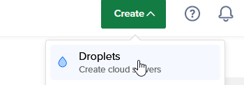

## Select OS and Specs
Select New York (any datacenter) for lowest ping to 2b2t and best connection reliability
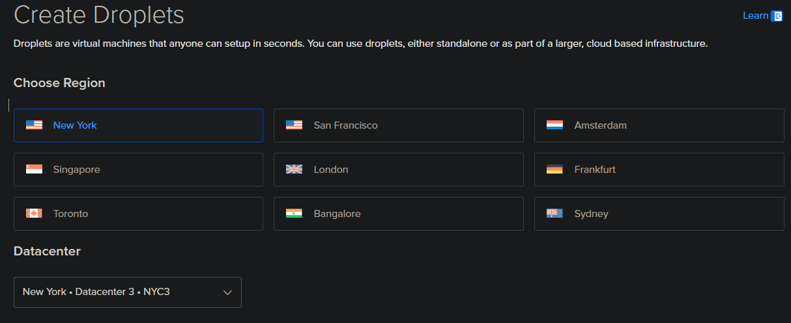

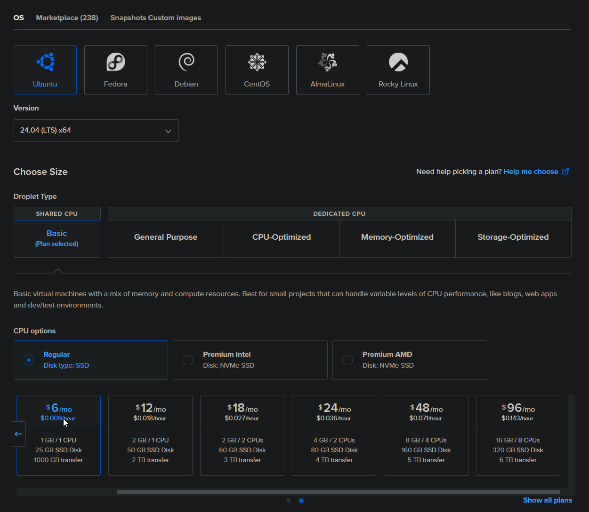

## Setup Authentication

Set a password, or an SSH key if you are familiar with them

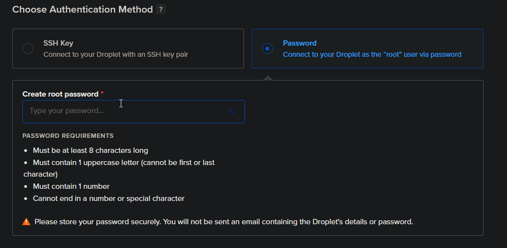

## Click Advanced Options
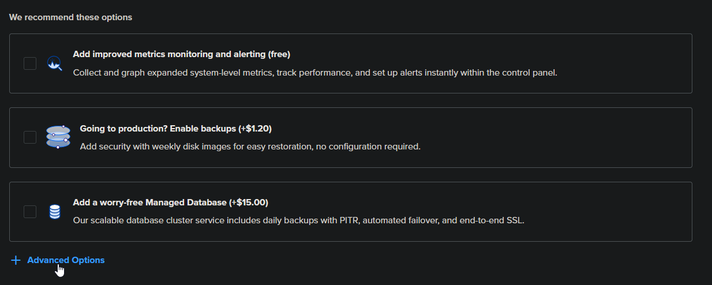

## Click Add Initialization Scripts
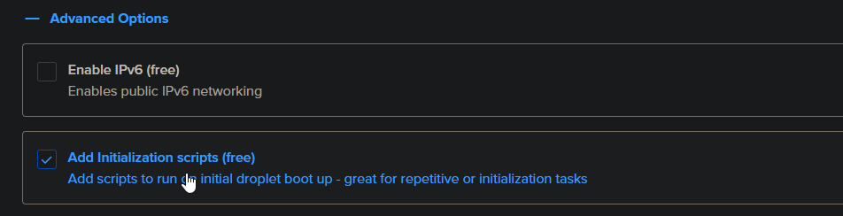

## Copy Paste the Setup script

Script link: https://github.com/rfresh2/ZenithProxy/blob/1.21.4/scripts/cloud-init.yaml

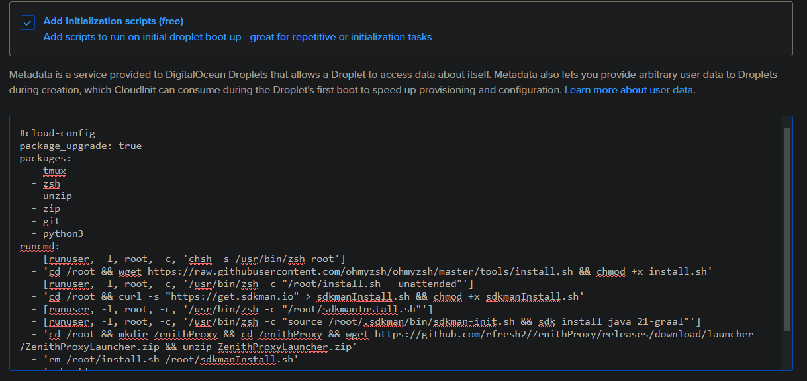

The setup script will automatically download the ZenithProxy launcher to `~/ZenithProxy`, and install recommended tools like `tmux`.

## Create Droplet
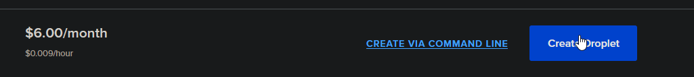

Wait about 5-10 mins for the droplet to fully setup before proceeding.

## SSH to the droplet

Find and copy the droplet's IP address on the DigitalOcean homepage

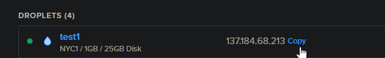

I recommend using [Windows Terminal](https://apps.microsoft.com/detail/9N0DX20HK701?hl=en-us&gl=US)

Open the terminal and type:

`ssh root@<IP>`

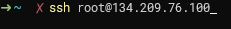

After, it will prompt you for a password if one is set.

If so, type the password and press enter. The password input is hidden while you are typing.

## Setup and Launch ZenithProxy

Start a tmux session:

`tmux`

If you did this successfully you should see a big green bar appear at the bottom

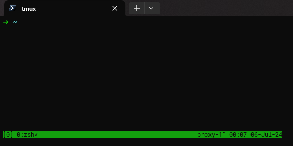

Change directories to the ZenithProxy folder:

`cd ZenithProxy`

Run the launcher:

`./launch`

During setup, select the `linux` platform:

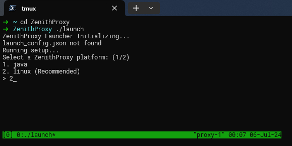

Complete the rest of the setup and you're done.

Refer to the other documentation pages for further help:

[Discord Bot Guide](Discord-Bot-Guide.md){ .md-button .md-button--primary }

[Commands](Commands.md){ .md-button .md-button--primary }

[Setup](Setup.md){ .md-button .md-button--primary }

for tmux help see: https://tmuxcheatsheet.com/
