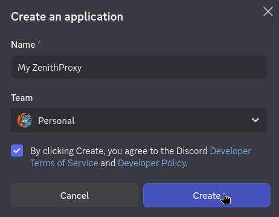
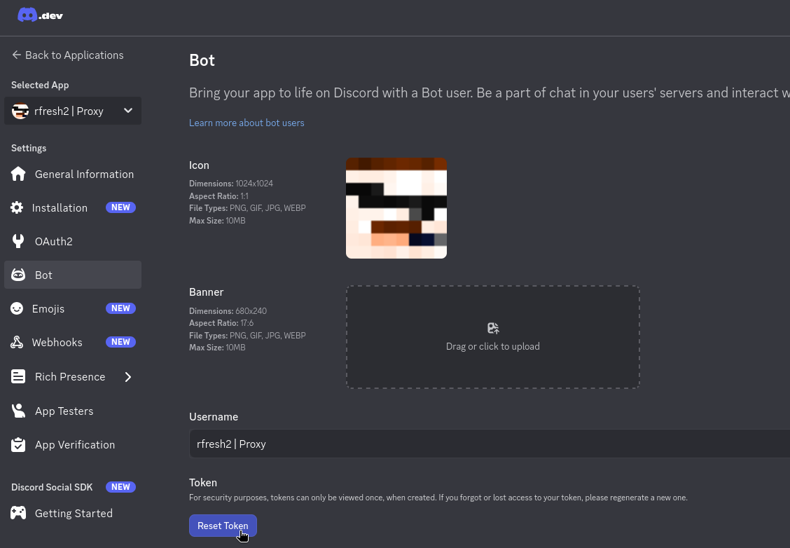
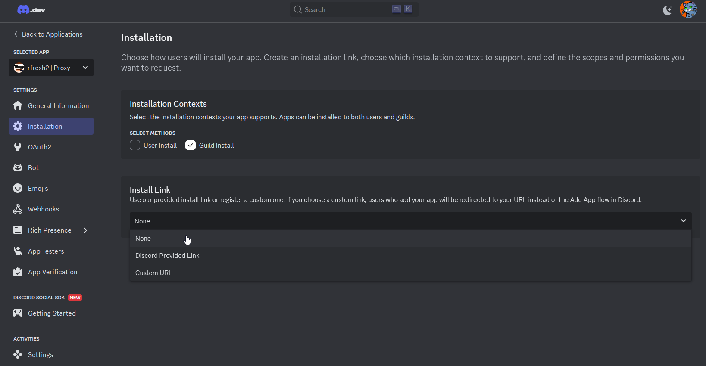
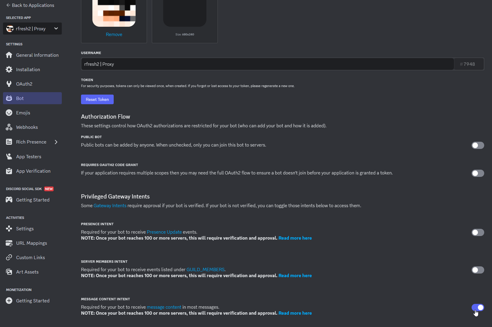
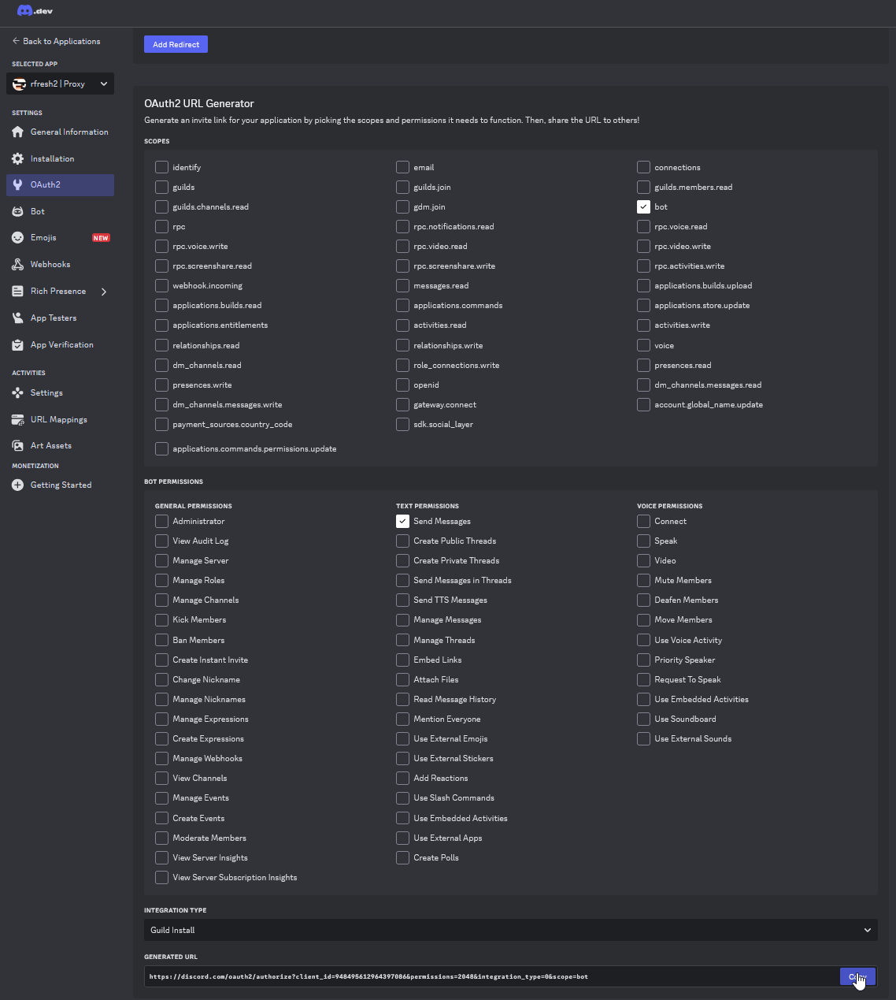
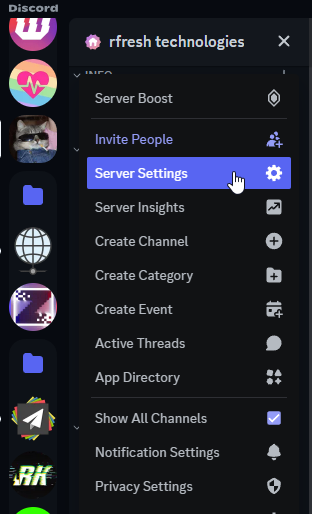
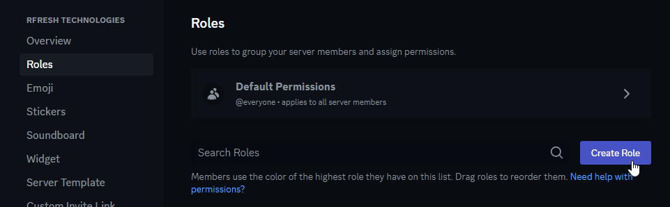
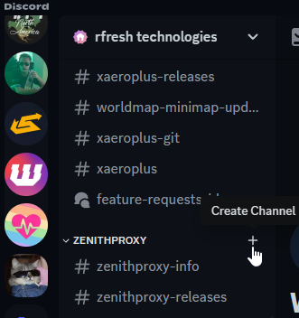
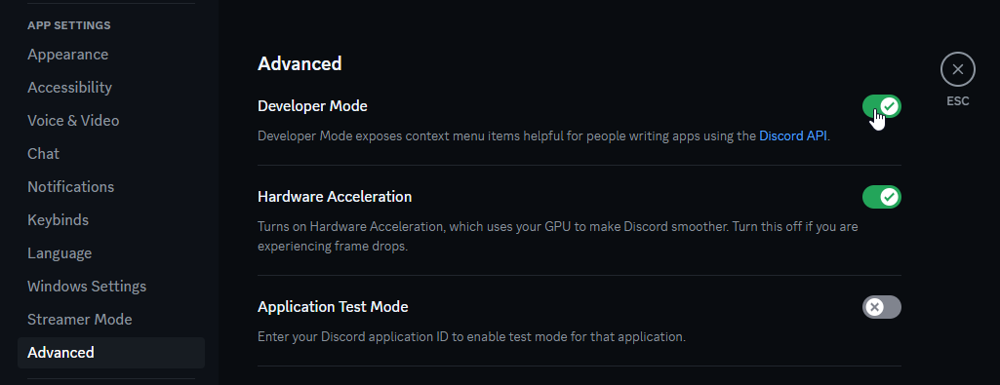
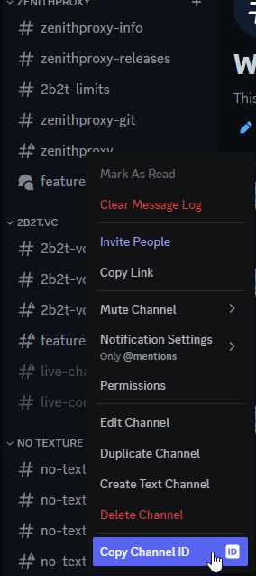

# Discord Bot Guide

## Create Bot

Create a discord bot here: https://discord.com/developers/applications

Click the `New Application` button, give it any name, and select `Create`

## Bot Token

On the left sidebar, select `Bot`, then click `Reset Token`

After confirmations, the token and a `Copy` button should appear

## Bot Settings

In the `Installation` tab settings:

* set `Install Link` to None
* `Guild Install` should be checked
* `User Install` doesn't matter.

In the `Bot` tab:

* Enable `Message Content Intent`
* Disable `Public Bot`

## Invite Bot To Server

In the `OAuth2` tab, generate an invite link with these permissions:

Open the invite link in a web browser and select the server to invite the bot to

## Discord Server Setup

In the discord server settings:

1: Create a role for users to manage the bot:

2: Assign the role to yourself and any other users who should be able to manage the bot.

3: Create a channel to manage the bot in:

4: (Optional) Create another channel for ZenithProxy's chat relay (live chat)

## Configure ZenithProxy

At first launch, the launcher will ask you to configure the token/role/channel ID's

If you didn't do this or misconfigured it, you can use the [discord](Commands.md#discord_1) and [chatRelay](Commands.md#chatrelay) commands after

To get the role and channel ID's, you must enable `Developer Mode` in your discord user settings:

Right-click on the roles/channels you created and click `Copy ID`

