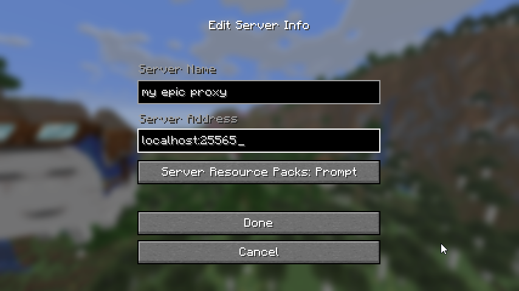
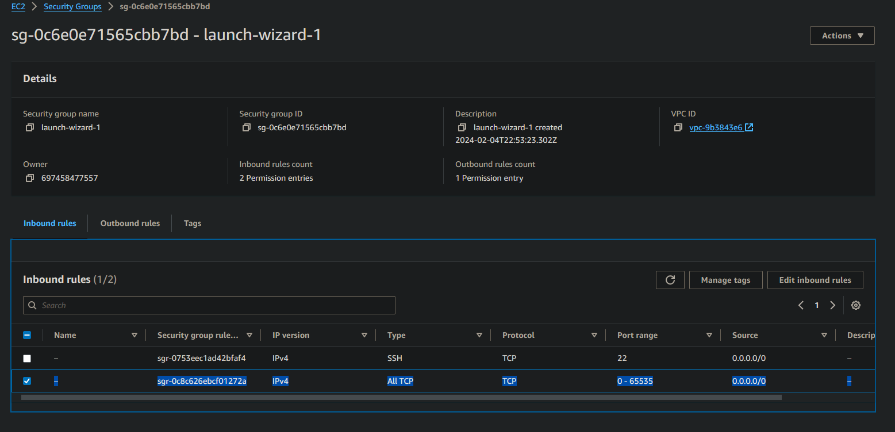
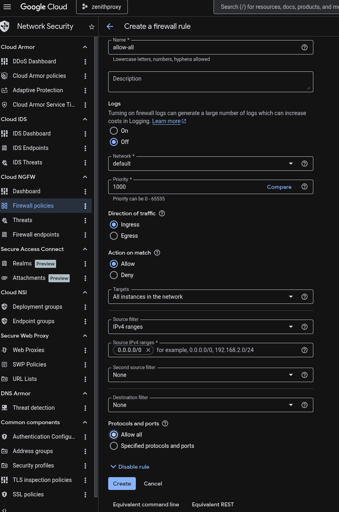

# Frequently Asked Questions (FAQ)

## Switch Accounts

`disconnect`

`auth clear`

`connect`

If the Microsoft website is automatically logging you in with the wrong account, open the login link in an incognito/private browsing window.

## Switch the MC server ZenithProxy connects to

`server <address>`

Example: `server connect.2b2t.org`

## I keep getting disconnected from 2b2t!

Refer to the [Disconnects](./Disconnects.md).

In particular, for disconnects like:

> Read timed out.

> Connection closed

> java.net.SocketException: Connection Reset

> io.netty.channel.unix.Errors$NativeIoException: Broken Pipe

These are caused by your internet connection to 2b2t. There is nothing you or I can do to prevent this.

If you have an unstable internet connection, consider hosting on a VPS.

## I don't know how to connect to my proxy!

Run the ZenithProxy command: `status`

Look for `Proxy IP`

Connect to that IP in your MC client



## I can't connect to my proxy!

First step, run the ZenithProxy command: `connectionTest`

If it shows an error related to firewall:

### Oracle Cloud

```bash
sudo iptables -I INPUT -j ACCEPT
sudo su
iptables-save > /etc/iptables/rules.v4
exit
```

source: https://www.reddit.com/r/oraclecloud/comments/r8lkf7/a_quick_tips_to_people_who_are_having_issue/

### AWS

AWS calls their firewall a "Security Group".

Edit it to allow all traffic:



### Google Cloud

Edit the network attached to your VM and add a firewall rule that allows all inbound traffic:


### Other

Consult your provider's website and documentation

## I'm self-hosting ZenithProxy on my home PC. How can my friends connect?

### Option 1: Tunneling

Use a service like [playit.gg](https://playit.gg/) to create a network tunnel for your friends to connect to.

You can set it up same as a normal Minecraft server, using the port ZenithProxy is listening on (`serverConnection` command to check port)

### Option 2: Port Forwarding

Automatic port forwarding: `serverConnection upnp on`

The automatic method may not work depending on your router.

Otherwise you will need to manually set up port forwarding on your router, google your router model + "port forwarding" for instructions.

### Option 3: VPS

Host ZenithProxy on a VPS instead of your home PC.

A VPS will have a public IP address anyone can connect to.

## Spammer isn't working on 2b2t

It means you are muted, or your chats are being filtered

Everyone is muted on login until you've walked around a bit

There's also chat filters for banned words and characters

And lastly there are moderators and automated tools who can mute you without warning

## How to set up the pearl loader bot

First, set up pearls with the [pearlLoader](./Commands.md#pearlloader) commands

You can then use ZenithProxy commands to load pearls.

To be able to use the commands ingame while not connected to ZenithProxy:

### Option 1: Whisper Commands

Use the [ZenithProxyChatControl](https://github.com/rfresh2/ZenithProxyChatControl) plugin

### Option 2: ZenithProxyMod + ZenithProxyWebAPI

Use the [ZenithProxyWebAPI](https://github.com/rfresh2/ZenithProxyWebAPI/) plugin

and [ZenithProxyMod](https://github.com/rfresh2/ZenithProxyMod/)

Load pearls over the API [with this command](https://github.com/rfresh2/ZenithProxyMod#web-api-commands)

## Can I run ZenithProxy while my PC is off?

No.

Some people use a spare computer.

Some choose to rent a computer in a datacenter (VPS), I recommend [DigitalOcean](./DigitalOcean-Setup-Guide.md).

## How can I make my Xaero map work while using ZenithProxy?

By default, Xaero chooses which map files to use based on the server IP.

You can find the map files currently in use with the XaeroPlus commands:

`/xaeroDataDir` and `/xaeroWaypointDir`

The issue is ZenithProxy has a different IP than connecting directly to 2b2t (or other servers).

### Option 1: Change Data Dir Mode

XaeroPlus has a setting: `Xaero Data Dir Mode` you can set to `Server Name`. (in the `XaeroPlus WorldMap Settings` page)

"Server Name" meaning the name you set up in your ingame server list.

So, if you set up your servers all with the same name, they will all use the same map/waypoints folder.

You will need to manually copy/move your existing map/waypoint files to the new folder.

### Option 2: Symlinks

A symlink is like a shortcut to a folder. Meaning you can forward one folder to another.

So, you can symlink the map/waypoint folders used by each ZenithProxy IP to your main map/waypoint folders.

More info in my discord: https://discord.com/channels/1127460556710883391/1127461243054202921/1272355246206619711

## Who are these unknown people pinging or trying to connect to my proxy?

if you host something on your home PC, in most cases, it is _not_ exposed to the public internet by default

Windows has a firewall, and your router needs to have port forwarding configured

but if you host something on the public internet, anyone on the public internet can find it

there are only ~4 billion possible ip's. And it's possible to scan 4b ip's in under an hour

people have been doing this for many years across every minecraft server. some groups involved are: 5c, serverseeker, matscan, and many more

to be clear, finding a proxy's public ip does not let them get past the whitelist

if you are hosting on the public internet, and it makes you uncomfortable, there are some things you can do:

* disable server list pings: `serverConnection ping off`
* set up a DNS hostname, and then set `serverConnection enforceMatchingConnectingAddress on`
* make yourself more difficult to find: `serverConnection port <port>` with something non-standard, maybe something random between 30000-65535
* set up a firewall on your OS that only allows you/your friends ip's to connect
* host on a private network instead like with tailscale, hamachi, etc
