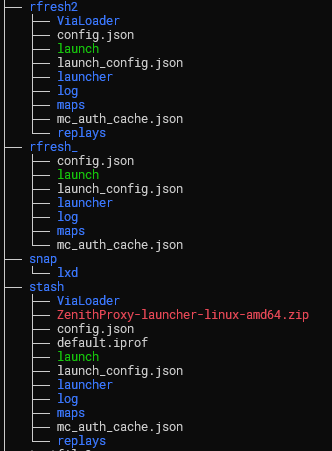
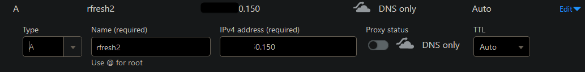
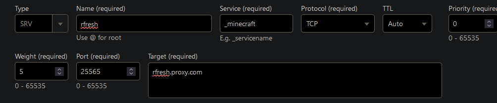

## Setup and Download

### System Requirements

* Linux, Windows, or Mac computer.
    * I recommend using a VPS (Virtual Private Server) from DigitalOcean (droplet)
* Minimum System specs:
    * `linux` release channel (Linux on x64 CPU):
        * ~250MB RAM
    * `java` release channel (Any OS and CPU):
        * ~600MB RAM

???+ tip "Don't have enough RAM on your Linux VPS?"

    Use your hard drive as (slow) RAM: [https://linuxize.com/post/create-a-linux-swap-file/](https://linuxize.com/post/create-a-linux-swap-file/)

### Setup Guides

* [DigitalOcean VPS + $200 free credits + auto setup script](DigitalOcean-Setup-Guide.md)
* [Windows](Windows-Python-Launcher-Guide.md)

### Downloads

* [Windows x64](https://github.com/rfresh2/ZenithProxy/releases/download/launcher-v3/ZenithProxy-launcher-windows-python-amd64.zip)
* Linux: [x64](https://github.com/rfresh2/ZenithProxy/releases/download/launcher-v3/ZenithProxy-launcher-linux-amd64.zip) or [aarch64 (ARM)](https://github.com/rfresh2/ZenithProxy/releases/download/launcher-v3/ZenithProxy-launcher-linux-aarch64.zip)
* Mac: [M-series CPU](https://github.com/rfresh2/ZenithProxy/releases/download/launcher-v3/ZenithProxy-launcher-macos-aarch64.zip) or [x64 (Intel)](https://github.com/rfresh2/ZenithProxy/releases/download/launcher-v3/ZenithProxy-launcher-macos-amd64.zip)
* Alpine Linux (musl): [x64](https://github.com/rfresh2/ZenithProxy/releases/download/launcher-v3/ZenithProxy-launcher-alpine-amd64.zip) or [aarch64](https://github.com/rfresh2/ZenithProxy/releases/download/launcher-v3/ZenithProxy-launcher-alpine-aarch64.zip)
* Other: [Python (Universal)](https://github.com/rfresh2/ZenithProxy/releases/download/launcher-v3/ZenithProxy-launcher-python.zip)
    * Recommended with: [install uv](https://docs.astral.sh/uv/getting-started/installation/#installing-uv)

Source: https://github.com/rfresh2/ZenithProxy/releases/tag/launcher-v3

#### Instructions

1. Download the above launcher release for your OS and CPU
2. Unzip the file.
3. Run the launcher in a terminal:
    * Linux/Mac: `./launch`
    * Python: `.\launch.bat` (Windows) or `./launch.sh` (Linux/Mac)

??? info "How do I download a file from a Linux terminal?"

    Use [wget](https://linuxize.com/post/wget-command-examples/#how-to-download-a-file-with-wget):

    `wget https://github.com/rfresh2/ZenithProxy/releases/download/launcher-v3/ZenithProxy-launcher-linux-amd64.zip`

??? tip "Recommended unzip tools"

    * Windows: [7zip](https://www.7-zip.org/download.html)
    * Linux: [unzip](https://linuxize.com/post/how-to-unzip-files-in-linux/)
    * Mac: [The Unarchiver](https://theunarchiver.com/)

??? tip "Recommended Terminals"

    * Windows: [Windows Terminal](https://apps.microsoft.com/detail/9N8G5RFZ9XK3)
    * Mac: [iterm2](https://iterm2.com/)

### Usage

The launcher will ask for required configuration on first launch

Use the `connect` command to link an MC account and log in once launched

Command Prefixes:

* Discord: `.` (e.g. `.help`)
* In-game: `/` OR `!` -> (e.g. `/help`)
* Terminal: N/A -> (e.g. `help`)

???+ tip "How to Rerun Launcher Setup"

    Run the launcher with the `--setup` flag. e.g. `./launch --setup`

???+ tip "How to exit a running instance"

    Press the keybind: `control + c`

    Some terminals have alternate keybinds. If all else fails, just close the window

[Full Commands Documentation](Commands.md){ .md-button .md-button--primary }

[Frequently Asked Questions](FAQ.md){ .md-button .md-button--primary }

### Release Channels

ZenithProxy releases for multiple MC versions and OS/hardware platforms, known as "release channels"

**Platforms**

* (Default) `java` - Works on all systems. Supports [Plugins](Plugins.md).
* (Recommended) `linux` - Linux native x64 executable. ~50% reduced memory usage and instant startup

**MC Versions**

* (Default) `1.21.4` - Matches current 2b2t server version
* Latest MC version is also usually supported. Other MC versions may exist but are deprecated.

??? note "Connecting to or from other MC versions with ZenithProxy's built-in ViaVersion"

    ZenithProxy's built-in ViaVersion is configured by default to work with any MC version.

    It can be configured with the [`via`](Commands.md#via) command

To select a specific release channel, use the [`channel`](Commands.md#channel) command

Example: `channel set java 1.21.4`

To see the current release channel, use the [`status`](Commands.md#status) command, the channel is at the top of the response.

### Hosting Providers

See [Hosting Providers](Hosting-Providers.md)

### Running on Linux Servers

See the [Linux Guide](Linux-Guide.md)

I highly recommend using a terminal multiplexer - a program that manages terminal sessions.

If you do not use one, **ZenithProxy will be killed after you exit your SSH session.**

* (Recommended) [tmux](https://tmuxcheatsheet.com/how-to-install-tmux/)
* [screen](https://linuxize.com/post/how-to-use-linux-screen/)
* [pm2](https://pm2.keymetrics.io/docs/usage/quick-start/)

### Running Multiple Instances

Create a new folder for each instance with its own copy of the launcher files.

??? info "Image"

    

Instances must be independently run and configured. i.e. separate terminal sessions, discord bots, ports, config files, etc.

See the [Linux Guide](Linux-Guide.md) for help copying files, creating folders, etc.

### 2b2t Limits

2b2t limits accounts without priority queue based on:

1. Accounts currently connected per IP address
2. In-game session time, excluding time in queue.

Current limits are documented in [a discord channel](https://discord.com/channels/1127460556710883391/1200685719073599488) in my [server](https://discord.gg/nJZrSaRKtb)

### DNS Setup

To use a domain name you need the following DNS records:

An `A` record to the public IP address of your server
??? info "Image"

    

An `SRV` record for `_minecraft._tcp` with the port and the `A` record as its target.

??? info "Image"

    
