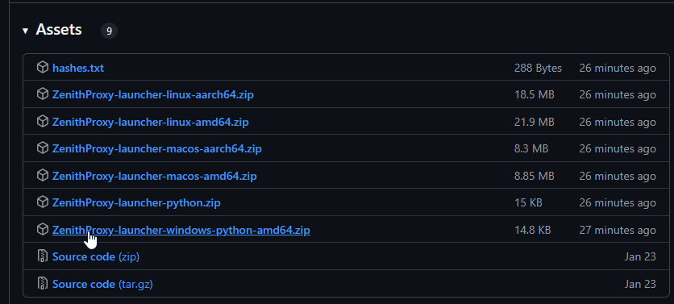
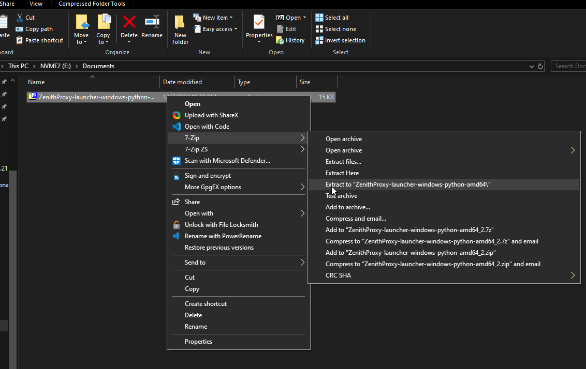
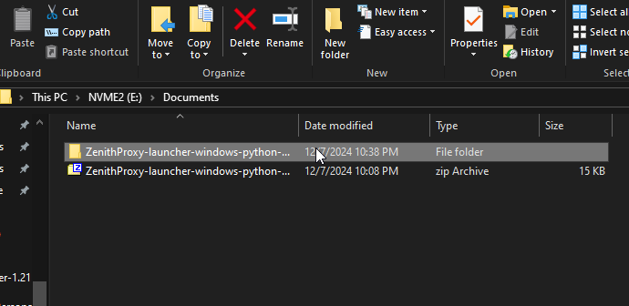
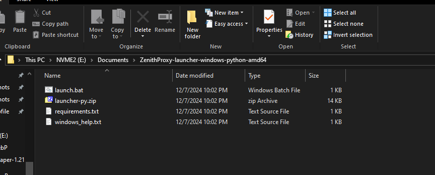
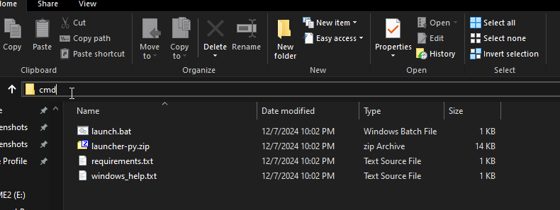
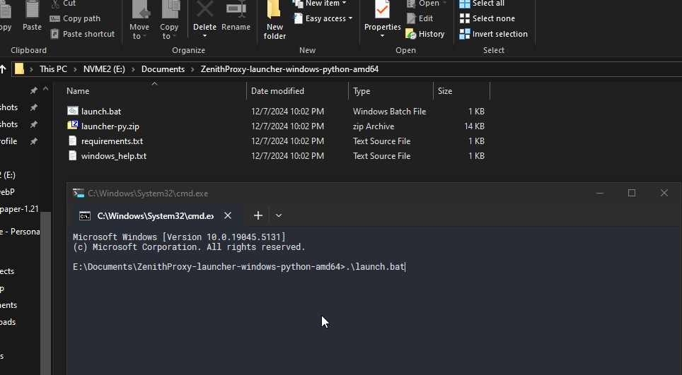
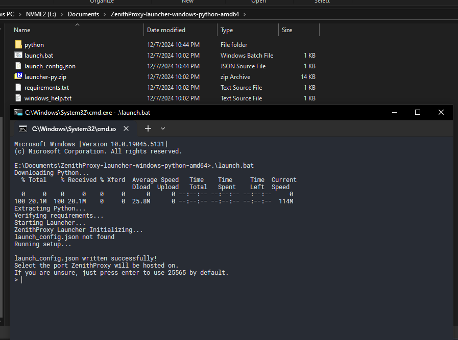

# ZenithProxy Launcher for Windows

## Prerequisites

* Windows 10+
* You do NOT need to install Python or Java yourself, the launcher will do it automatically

## Steps

### Download
Download `ZenithProxy-launcher-windows-python-amd64.zip` here: https://github.com/rfresh2/ZenithProxy/releases/download/launcher-v3/ZenithProxy-launcher-windows-python-amd64.zip

### Unzip

Unzip the file. It does not matter which folder you move or extract the files to.

I recommend using 7zip: https://www.7-zip.org/

### Open

Open the folder you extracted the launcher to

### cmd

Open `cmd`

Enter "cmd" into the windows file search and press enter

### Run

Run the launcher

Enter `.\launch.bat` and press enter

Complete the setup prompts

Refer to the other documentation pages for further help:

[Discord Bot Guide](Discord-Bot-Guide.md){ .md-button .md-button--primary }

[Commands](Commands.md){ .md-button .md-button--primary }

[Setup](Setup.md){ .md-button .md-button--primary }
